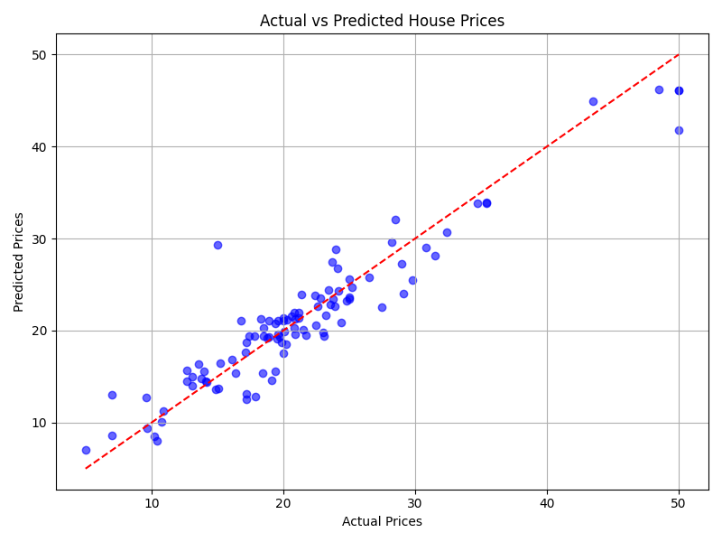
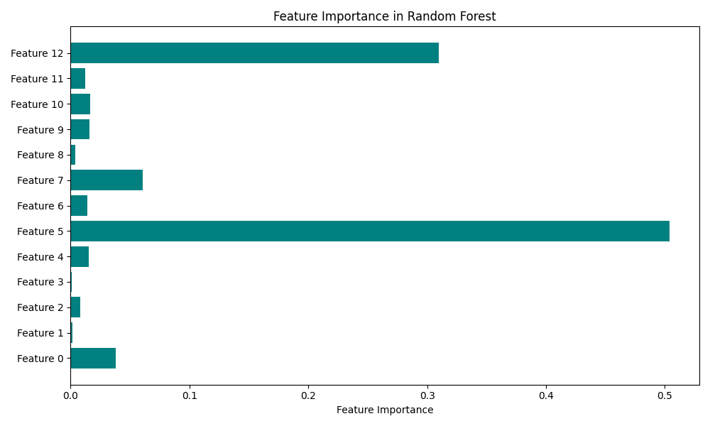

# Boston Housing Price Prediction 🏡📈

This project uses a machine learning model to predict Boston housing prices based on features such as crime rate, number of rooms, accessibility to highways, and more.

---

## 📊 Project Structure

- **R² Score**: 0.86 _(example — add actual value from model evaluation)_
---

## 💡 Objective

Build a regression model to predict the median value of owner-occupied homes (`MEDV`) in Boston using multiple features from the dataset.

---

## ⚙️ Technologies Used

- Python 3.x
- pandas, numpy
- matplotlib, seaborn
- scikit-learn
- joblib (for model saving)

---

## 📈 Results

- **Model Used**: Random Forest Regressor
- **R² Score**: _(Add your score here)_
- Feature importance and prediction vs actual values are visualized in the `plots/` folder.

## 🖼️ Visualizations

### 🔹 Prediction vs Actual Values
This plot shows how close the model's predictions are to the actual housing prices.

---

### 🔹 Feature Importance
This bar chart highlights which features (like number of rooms or crime rate) are most influential in predicting house prices.




---
## 🚀 How to Run

1. Clone the repository:
   ```bash
   git clone https://github.com/ronak171990/boston-housing-prediction.git
   cd boston-housing-prediction
